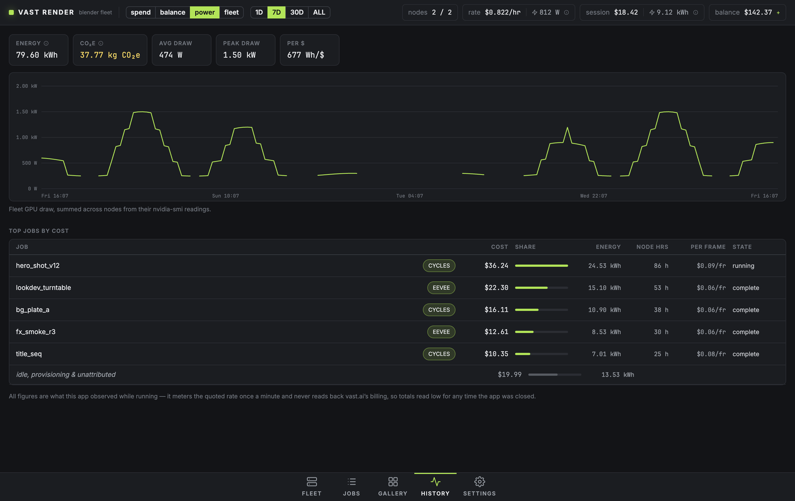

<p align="center"></p>

<h1 align="center">Vast Render</h1>

<p align="center"><b>Render Blender animations on a fleet of rented GPUs — from your desktop.</b><br>
macOS · Windows · <a href="https://github.com/elliotwoods/vastai-blender/releases/latest">Download</a></p>

Vast Render is a desktop app for macOS and Windows that renders Blender projects on
[Vast.ai](https://vast.ai) GPU fleets. Point it at a `.blend`, and it rents the best-value machines,
provisions them (matching Blender version, ffmpeg, render agent), splits the
animation into frame chunks across the fleet, streams frames and HDR preview
clips back to your disk as they finish, and destroys the machines once they go
idle. Quitting asks whether to destroy the fleet or leave it running (see
[Safety model](#safety-model)).

Vast.ai rents time on other people's GPU machines — typically far cheaper than
dedicated cloud render farms. This app automates the whole lifecycle from an
API key: no manual SSH, no third-party file sync.


*The fleet: one row per rented machine with live %GPU, %VRAM, %CPU, %RAM,
watts, $/hr and accumulated cost. Expanding a row shows the full node panel —
gauges, ssh access, what it's rendering, and its console. The toolbar keeps the
whole fleet's $/hr, live GPU power draw, session spend and energy, and your
Vast.ai balance in view on every screen.*

## Features

- **Fleet rendering** — set a max node count and a spend cap; jobs are split
  into frame chunks and distributed. Failed machines are replaced and only
  missing frames re-render.
- **Node sharing** — tick *Share node* on a job whose renders leave the
  machine under-used (a long CPU step before each frame, say) and its chunks
  run alongside other renders instead of taking a whole node each. The app
  measures throughput per node and tunes the number of concurrent renders on
  its own; *Max render slots per node* in Settings caps it if you want.
- **Per-GPU render slots** — on a multi-GPU node each GPU renders its own
  Cycles chunk (pinned with `CUDA_VISIBLE_DEVICES`), so per-frame CPU work such
  as scene sync doesn't idle the other GPUs. One or two slots per GPU, or off,
  in Settings; *Min GPUs per node* in the offer filters. EEVEE and Octane
  chunks take the whole node, and a Cycles chunk that finds a node with cards
  to spare (the tail of a job, say) runs across all of them. A node that runs
  out of GPU memory with two renders on a card drops to one per card. A
  lane is free as soon as its render ends, so the next chunk loads while the
  last one's frames download.
- **Render timing** — Cycles frames are timed phase by phase (load,
  evaluation, sync/BVH, sampling, save) and each render's peak VRAM is
  measured; the job screen shows where the time goes and how busy the GPU
  really was.
- **Engines** — Cycles (OptiX/CUDA), EEVEE (per-node capability
  probe), Octane (see `docs/OCTANE.md`).
- **Automatic Blender version matching** — the app reads each `.blend`'s
  header and installs the matching Blender release on the nodes
  (side-by-side per version; override in Settings).
- **Direct, verified transfers** — scenes go up and frames come down over the
  instance's own SSH (SFTP, SHA-256 verified, resumable). No Dropbox, no
  cloud bucket, no credentials on untrusted machines, except Octane's
  opt-in scripted OTOY sign-in (see `docs/OCTANE.md`). A job keeps its own
  copy of the `.blend` as submitted (`scene.blend` in its folder), so saving
  the scene mid-render doesn't mix two versions; each node receives it once.
  A full disk on this computer pauses downloads and new work, and they resume
  on their own once there is room.
- **Remote preview encodes** — each chunk is encoded on the node to H.265:
  SDR, 10-bit HLG BT.2020 **HDR**, and a small proxy — all All-Intra for
  frame-exact scrubbing.
- **Whole-job preview** — as chunks finish, the desktop stitches their preview
  clips end to end (a lossless remux, no re-encode) into one clip per job. However
  finely a job is chunked across the fleet, it plays and scrubs as one clip;
  chunks still rendering show as gaps you can click into to watch live.
- **Gallery** — a video wall of preview clips with a frame-exact transport
  (timecode, frame stepping, draggable playhead), exposure/grade controls,
  HDR passthrough on HDR displays, and click-to-open into Explorer for every
  frame, clip and folder.
- **Extensions** — register Blender extension zips (Blender 4.2+ manifest
  format) in Settings; they're uploaded and enabled on nodes per job. Scenes
  can also carry `startup*` text blocks, executed before rendering.
- **Live telemetry** — %GPU, %VRAM, true %CPU (from `/proc/stat` deltas, not
  load average), %RAM, GPU watts, and Wh of energy per node.
- **GPU usage over time** — the Fleet screen charts GPUs busy against GPUs
  rented, with mean utilisation and what the idle ones cost per hour (15 min
  to 24 h). Each node row has a 30-minute utilisation sparkline, and an
  expanded node charts utilisation and VRAM per GPU and total power, shading
  where a GPU sat at or under 10% with a render assigned to it.
- **History** — spend, account balance, fleet GPU power and fleet size over
  1 day / 7 days / 30 days / all time, with the jobs that cost the most and an
  estimated CO₂ figure behind every energy readout.
- **Cost control** — live $/hr and fleet power draw, per-node metered spend,
  total spend and this session's energy, account balance with its runway,
  idle-timeout auto-destroy, a spend cap every rental must fit under, a quit
  that asks before leaving anything billing, a pause on renting when the
  balance runs low, and a reconcile every 5 minutes that destroys instances
  this profile lost track of and lists everything else on the account. All of
  it has limits; see [Safety model](#safety-model).



*History: fleet GPU draw over the last week, with energy, CO₂e, average and
peak draw, and the jobs that cost the most.*

## Install

Download the latest build from
[Releases](https://github.com/elliotwoods/vastai-blender/releases/latest):

| Platform | File | Notes |
| --- | --- | --- |
| macOS (Apple Silicon) | `vastai-blender-<version>.dmg` | Signed with a Developer ID and notarized by Apple — open the DMG and drag *Vast Render* to Applications. |
| Windows 10/11 (x64) | `vastai-blender-<version>-setup.exe` | Unsigned, so SmartScreen asks for a confirmation on first run (*More info → Run anyway*). |

You need a [Vast.ai](https://vast.ai) account with some credit and an API key —
see [First run](#first-run).

## Build from source

```bash
npm install
npm run dev          # development (Vite + Electron, hot reload)
npm run build:win    # packaged Windows build (electron-builder)
npm run build:mac    # packaged macOS build — signs with your Developer ID;
                     # set APPLE_KEYCHAIN_PROFILE to a notarytool profile to notarize
npm test             # node agent self-check (skipped with a note if no python3), then unit tests
npm run typecheck    # main + renderer type checks
```

CI (`.github/workflows/ci.yml`) runs both typechecks, eslint, the unit tests,
the agent self-check and syntax checks over `remote/` on every push and pull
request. None of it needs Electron, a GPU or a Vast.ai account.

If `npm run dev` reports "Electron uninstall", the Electron binary download
was interrupted — see `docs/hdr-notes.md` for the manual fix.

## First run

1. **Settings → Vast.ai API** — paste your API key (from
   [cloud.vast.ai](https://cloud.vast.ai) → Account). It's stored encrypted
   with your OS user credentials (DPAPI on Windows, the Keychain on macOS). An
   SSH keypair is generated on first use and registered with your Vast.ai
   account.
2. **Settings → General** — set the project root (where renders land), max
   active nodes, spend cap ($/hr), idle timeout, and (optionally) a cap on
   render slots per node — leave it blank to let the app judge concurrency.
   With the spend cap blank, scale-up rents nothing; tick *no spend cap* to
   rent without one.
3. **Settings → Offer filters** — GPU allowlist, max $/hr, minimum
   VRAM/network/reliability. Turn on *CPU-bound* for scenes whose frame time
   is dominated by CPU work, so ranking stops favouring premium datacenter
   GPUs.
4. **Settings → Extensions** *(optional)* — register any Blender extension
   zips your scenes need.


## Rendering a job

Only the `.blend` itself is uploaded; nothing it references on your disk
reaches the node. Before submitting:

- **Pack what can be packed**: File → External Data → Pack Resources (images,
  fonts, volumes), plus Pack Linked Libraries for linked `.blend` files, which
  Pack Resources and its *Automatically* toggle leave out.
- **Bake simulations** (rigid body, cloth, particles, simulation nodes) and
  keep the bake inside the file, not in a disk cache. Each chunk renders in a
  fresh Blender starting at the chunk's first frame, so an unbaked simulation
  starts cold in every chunk after the first, and in every chunk when the step
  is above 1. A chunk size covering the whole range renders it in one go, but a
  retry after a failure restarts part-way through, cold.
- Image sequences, movie clips, Alembic/USD caches and files over 2 GB cannot
  be packed, and neither can fluid (Mantaflow) bakes, which Blender writes only
  to a disk cache. Scenes that need any of them are not supported yet.
- Render to an image format (OpenEXR, PNG, …), not a movie: each chunk saves
  one image per frame.

A scene preflight on the node checks this before Blender renders the first
frame of each chunk. Unpacked files or libraries the render reads, missing
linked data, a movie output, and a simulation that is not baked into the
file when the job is split into more than one chunk each fail the job at
once, with no retries spent, and the job page says what to fix. Things the
render never reads (a hidden object's texture, a reference image) are only
warnings. The check runs on a rented node, so the first node has already
booted and billed by then.

**Jobs → new render**: pick `.blend` file(s), the engine, the frame range and
step, optionally the extensions to enable and a chunk size (blank = the
scheduler picks one so each node gets ~3 chunks). Submit.


From there it is automatic: nodes start while there's queued work, chunks are
dispatched, frames download as they are rendered, and nodes are destroyed
once they've been idle past the timeout, as long as the app is running (see
[Safety model](#safety-model)). A job page shows per-chunk state and the live
console; the Gallery shows the preview clips as they arrive.

Useful controls while a job runs:

- **Fleet → max nodes** — raise it and the scheduler rents toward it while
  there's work and the spend cap allows. Lowering it only stops new rentals:
  nodes already running stay until they idle out or you destroy them.
- **Fleet → + request node** — add one machine now. It counts against max
  nodes. Past the spend cap it asks first, and then rents at no more than the
  offer filters' max $/hr, or the cap itself when the filters set no price.
- **Fleet → row → ssh** — open a terminal on that machine using the app's own
  key (clicking the ssh endpoint copies the command instead).
- **Fleet → row → destroy** — kill a bad machine; its chunks are re-queued.
  Destroy, cancel and the other buttons that cost work or money ask for a
  second click.
- **Fleet → row → reprovision** — ship the scripts again and restart the
  node's agent. Its renders go back to the queue, charged to the chunks'
  allowance for machine failures, not their render retries.
- **Job page → cancel** — stop dispatching and stop the job's renders on the
  nodes; frames already downloaded are kept.
- **Job page → re-render missing** — queue again the frames that never
  arrived, with fresh retries. Frames already on this computer are not
  rendered again. It is not offered for a job that failed outright (a scene
  the preflight refused, say), which would fail the same way.
- **Job page → resume** — a job whose chunks failed the same way on two
  nodes is held, and nothing more of it is sent until you resume it.
- The job page shows *scene changed since submit* when the `.blend` was
  saved after the job was submitted. The job keeps rendering its own copy;
  submit again to render the new version.

## Safety model

Rented machines bill by the hour whether or not they render. What the app
does about that, and what it doesn't:

- **Quitting asks.** When any node may be billing, quitting (Cmd+Q, closing
  the last window on Windows and Linux, or Ctrl+C in the terminal) shows
  *N nodes are billing $X/hr* with three choices, every time:
  - **Destroy all & quit** stops renting and dispatching, destroys every node
    (3 s apart, dearest first) and quits once Vast.ai has confirmed each one
    gone. Renders in progress go back in the queue for next time. Anything it
    cannot confirm is listed with *Try again*, *Open Vast.ai console* and
    *Quit anyway*; *Quit anyway* leaves those instances billing.
  - **Leave running** quits at once. The nodes keep billing until the app,
    once open again, scales them down, or until you destroy them in the
    [Vast.ai console](https://cloud.vast.ai/instances/), or until the node
    lease below retires them.
  - **Cancel** goes back to the app.

  On macOS, closing the window does not quit: the app keeps managing the
  fleet. On Windows, a shutdown or sign-out destroys the fleet without asking,
  and so does closing the terminal that runs the app.
- **Sleep warns.** Going to sleep with nodes billing raises an alert and a
  notification: they keep billing, and nothing renders or downloads, until the
  computer wakes. On waking the app says about what the sleep cost, meters it,
  and reconciles the account at once. Nothing is destroyed for sleeping.
- **Node lease (not yet verified on a real node).** Each 15 s probe renews a
  lease on the node. A node that has heard nothing from the app for
  30 minutes, and has nothing rendering or queued, destroys its own instance
  (stopping OctaneServer first) using the per-instance key Vast.ai gives each
  instance: the app never sends your account key to a node. This covers
  *Leave running*, a crash, a closed lid or a lost network. Frames a node
  rendered but the app had not downloaded go with it, and render again once
  the app is back. There is no setting to turn it off, the app does not yet
  show whether a node's lease is armed, and a node whose agent is dead, or
  still busy with a render nobody collects, never destroys itself.
- **A restart stops in-flight renders, but re-renders only what is missing.**
  On launch the app re-provisions every node it can reach, which restarts its
  agent and stops the renders running there. Each chunk that was in flight is
  narrowed to the frames not yet on this computer, with no retry charged; a
  frame rendered but not downloaded is rendered again. Whenever unfinished
  work is left from the last session (and max nodes is above 1), renting
  waits behind a *Resume rendering* banner; nodes already up still take the
  work. The hold is saved, so it survives another relaunch, and it lifts by
  itself once none of that work is left.
- **The spend cap is a budget at rent time.** It counts every node that may
  still be billing, and a machine is rented only if its own price still fits
  under the cap. *+ request node* asks before going past it. A blank cap rents
  nothing unless *no spend cap* is ticked. Rates are the quotes at rent time,
  not vast.ai's invoice. The Fleet screen says why scale-up is or is not
  renting.
- **Credit guard.** The balance is read every minute and judged against
  what the whole account bills (this fleet plus any other instance on it).
  Under 30 minutes of runway you get a warning. Under 10 minutes, or when
  Vast.ai refuses a rental for lack of credit, renting pauses: no machine is
  blacklisted, nodes already rented keep rendering and billing, and renting
  resumes by itself once a top-up covers 20 minutes. A refused API key pauses
  renting until a key is saved or Vast.ai accepts it again. The toolbar's
  balance turns amber, then red, as the runway shortens.
- **Holds say why.** A banner above every screen lists each reason the fleet
  has stopped renting — the balance or API key, the local disk, scale-up
  backing off after failed rentals, unfinished work from the last session, an
  Octane sign-in nobody made — with what lifts it and a button where one
  helps.
- **Instance ownership and reconcile.** Each instance is labelled
  `vastai-blender <install>:<node>`, the first 8 characters of this install's
  id and its node's id (older `vastai-blender <node>` labels are still
  recognised). Every 5 minutes, at launch, on waking and when an API key is
  saved, the app compares the account with its own records. An instance
  labelled for one of this profile's nodes that the node no longer holds is
  destroyed (instances younger than 2 minutes are left for the next pass).
  Everything else is listed under **Fleet → Unclaimed instances** with its
  owner (this install, another Vast Render, or not Vast Render) and $/hr, and
  is destroyed only when you click *destroy* there, twice.
- **A destroy is done when Vast.ai confirms it.** A destroy that fails is
  retried every minute, and its node stays listed and counted as billing
  until Vast.ai no longer lists the instance. So does a rental whose create
  got no answer: the app looks for its instance by label rather than renting
  again, uses it or destroys it if found, and says so if Vast.ai stays silent.
- **Stuck nodes are let go.** A node that stops answering over SSH is taken
  out of work within about 45 s; if Vast.ai no longer knows its instance, or
  it does not come back within 10 minutes, it is destroyed and its chunks
  requeued. Provisioning has a 25-minute deadline. A Blender that starts or
  saves no frame for 3 times the slowest frame its job has taken on that
  hardware (at least 45 minutes; 3 hours before its first frame) is stopped,
  and its chunk requeued.
- **One app per profile.** A second launch on the same profile writes one
  line to stderr and quits with status 0, and the app already running brings
  its window forward. A `VR_JOB_SPEC` campaign is handed to the app already
  running, which submits it (see [Headless campaigns](#headless-campaigns)).
  Any other scripted launch — `VR_E2E_BLEND` or a window capture (`VR_SHOT`) —
  submits or captures nothing and exits with status 1. Scripted launches
  leave the running app's window alone. A `VR_USERDATA` profile is a separate
  profile, so it runs alongside.
- **Billing-risk alerts stay up.** A destroy that failed, or an instance left
  running, stays in a banner above every screen until you dismiss it, with a
  link to the Vast.ai console. An unexpected error in the app becomes an alert
  rather than a dialog that stalls it.

## Headless campaigns

For batches too big to click through, `VR_JOB_SPEC` submits a whole campaign
at boot:

```jsonc
{
  "blends": [
    "C:/scenes/shot_010.blend",
    { "path": "C:/scenes/shot_020.blend", "frameStart": 1, "frameEnd": 60 }
  ],
  // or "blendDir": "C:/scenes/campaign"
  "engine": "eevee",
  "frameStart": 1, "frameEnd": 200, "frameStep": 1,
  "addonZips": ["C:/addons/auroravision-0.2.0.zip"],
  "chunkSize": null,
  "maxActiveNodes": 4,
  "shareNode": true, // let these jobs co-run on a node (per-blend override too)
  "maxNodeSlots": 0, // 0/omitted = the app decides concurrency per node
  "slotsPerGpu": 1,  // renders per GPU on a node (0 = one process on all GPUs)
  "spendCapPerHour": 2,
  "offerFilters": { "cpuBound": true, "minNumGpus": 4 },
  "name": "hero pass", // names the job, or leads each job's name; a blend's own "name" wins
  "dedupe": "campaign" // or "never": submit every blend as a new job
}
```

```bash
VR_JOB_SPEC=C:/specs/campaign.json npm run dev
```

If the app is already open on the profile, the launch **hands the spec to
it** instead of starting a second app (only one app runs per profile; see
[Safety model](#safety-model)). The running app submits the campaign as a
headless run would, leaves its window as it is, and answers; the launch prints
the jobs it submitted and exits 0 when the whole campaign went in, or 1 with
what was not submitted and why. Relative paths in the spec are taken from the
directory the launch ran in. A running app from before hand-off gives no
answer, and the launch exits 1 after two minutes saying nothing is known to be
submitted. The spec's fleet settings are applied only when the running app has
no other open jobs, and released again when the campaign is done; while other
jobs are open, they must match what is already in force, otherwise nothing is
submitted, so a campaign never changes the fleet caps of work already running.
A spec without fleet settings just adds its jobs.

Each blend entry is **one job**, however many nodes render it. To put more
machines on a job, raise `maxActiveNodes` (and set `eagerFleet: true` to rent
ahead of demand) rather than shrinking `chunkSize`. Leaving `chunkSize` null sizes
chunks for about three per node.

Re-running the same spec **heals** partially complete jobs (revives failed
chunks) rather than duplicating them. Events and node logs are mirrored to
stdout in this mode so a scripted run is diagnosable.

The spec's fleet settings (`maxActiveNodes`, `spendCapPerHour`, `eagerFleet`,
`maxNodeSlots`, `slotsPerGpu`, `offerFilters`) apply to this run only: they
go through the same checks as the Settings screen, and `settings.json` is
never written. A clamped value is reported on stderr. If any of them cannot
be put in force, nothing of the campaign is submitted. A setting you change
in the app during the run is saved and replaces the spec's.

Submitting a campaign lifts the *Resume rendering* hold for its own jobs
only, and resumes a job it names again that the retry breaker held. Other
unfinished work on the profile stays held.

A headless run never shows the quit dialog. `VR_QUIT_POLICY` decides what
happens on Ctrl+C, SIGTERM, a closed terminal, a quit and the end of the
campaign:

- `destroy` (the default, and what any other value falls back to): once no
  job of the campaign is queued or running, the run destroys every node and
  exits; a signal or quit does the same sooner. A second Ctrl+C (or SIGTERM)
  at least 2 s after the first abandons the destroy.
- `leave`: exit and leave the nodes as they are; the next launch on the
  profile picks them up. A finished campaign does not end the run.

The exit status is 3 when something may be left billing (a destroy not
confirmed, or nodes left by `leave`), 1 when part of the campaign was never
submitted, and 0 otherwise.

Other environment switches (development aids):

| Variable | Effect |
| --- | --- |
| `VR_MOCK=1` | Serve mock nodes, jobs and history to the UI. Only reads are mocked: the real node manager and scheduler still run, and actions (request node, destroy, submit, cancel) reach the profile's real fleet. Use it only with `VR_USERDATA` |
| `VR_SCREEN=jobs` | Open on a given screen (`fleet`, `jobs`, `job`, `gallery`, `history`, `settings`, `gradelab`) |
| `VR_SHOT=out.png` | Capture the window after load (`VR_SHOT_DELAY` ms, default 6000) |
| `VR_USERDATA=dir` | Use a throwaway profile (own settings, own SQLite state, no API key) |
| `VR_E2E_BLEND=x.blend` | Single-blend end-to-end test run (rents real machines). Like `VR_JOB_SPEC`, it exits with status 1 if the profile is already open |

`VR_SCREEN` is appended to the dev-server URL verbatim, so it can carry the
screens' own parameters: `history&metric=power&range=7d`,
`settings&section=general`, `job&jobId=<id>`, `gallery&jobId=<id>&chunkId=<id>`,
`fleet&expand=1`, and `job&jobId=<id>&preview=<chunkId>&frame=<n>` to open the
preview overlay (otherwise only reachable by clicking, so uncapturable in a
scripted run). `gradelab&run=1` runs the grade-parity sweep and prints its result.

`VR_USERDATA` must be a **non-empty** path — an empty value falls back to the real
profile. On Windows, copy `Local State` from the real profile into a throwaway one
if you need the stored API key to decrypt there: Chromium keeps the `safeStorage`
key in that file, DPAPI-wrapped. A profile with a working key is a second fleet
on the same account. It rents up to its own max nodes and spend cap, not the
real profile's, and its reconcile lists the other profile's instances under
*Unclaimed instances* rather than destroying them.

## Local API and CLI

A running app can also be driven from scripts, without relaunching it. Turn
on **Settings › General › Local API**, or start the app with `VR_API=1`. The
app then serves a small HTTP API on `127.0.0.1` and writes its address and a
token to `api.json` in the profile folder. The folder button next to the
setting shows you the file. The token changes each time the API starts, and
the file is deleted when the app quits. Requests from web pages (anything with
an `Origin` header) are refused.

```bash
vast-render-cli submit ~/scenes/shot_010.blend --frames 1-120 --engine cycles --name "hero pass"
vast-render-cli list
vast-render-cli watch            # job, node and alert events as they happen
vast-render-cli rm <job> --cancel
```

`vast-render-cli` is `bin/vast-render-cli.mjs`: no dependencies, Node 18 or
later. Use `npm link` to put it on your `PATH`. It exits 0 when the command
succeeded, 1 when the app refused it (the reason is printed), and 2 when the
app is not running.

`POST /v1/jobs` takes the same spec as `VR_JOB_SPEC`, with every path
absolute. It also takes `name` and `dedupe`. It applies the same fleet
settings rule as a hand-off: a campaign's settings are used only when nothing
else is open. Every route, the security model and curl examples are in
[docs/API.md](docs/API.md).

## How machines are chosen

Offers are ranked by `perf-per-dollar × reliability² × network`, where
perf-per-dollar prefers **your own measured render throughput** for a GPU
model (learned from completed chunks, per GPU, and scaled by each offer's GPU
count) over Vast's synthetic benchmark. In
CPU-bound mode, machines with no measured throughput are ranked by CPU clock
and effective cores per dollar instead, with the GPU benchmark capped so it
only tie-breaks. The strategy lives in `src/main/vast/offers.ts`; filters are
in Settings → Offer filters.

## Repository layout

- `src/main` — Electron main process: Vast.ai client, SSH/SFTP, node
  lifecycle, scheduler, settings, SQLite state.
- `src/renderer` — the UI (React + TypeScript).
- `src/shared` — the typed IPC contract shared by both.
- `remote/` — scripts that run **on the nodes** (provisioning, render agent,
  preview encoder). Uploaded verbatim over SFTP; stdlib Python + bash only.
  `npm test` runs `remote/agent/selfcheck.py` first, which covers the agent
  behaviour that is easiest to get wrong.
- `docs/` — setup notes, Octane specifics, HDR/codec findings, screenshots.

## Notes

- The render output contract for previews assumes linear Rec.709 EXR
  (Blender's `Standard` view transform); scenes rendering to PNG/JPG still
  work but get SDR previews only.
- Blender 5.x defaults to a Vulkan GPU backend; provisioning installs the
  Vulkan loader and the EEVEE probe falls back to OpenGL when Vulkan is
  unavailable on a node.
- Spend, energy (Wh), GPU draw and fleet size are metered once a minute and
  persisted in SQLite, so the History screen survives a restart. Everything there
  is what this app metered from the quoted rates — it never reads back
  Vast.ai's billing. Time asleep is charged on waking, but totals read low for
  any period the app was closed.
- Versioning and release notes: see [CHANGELOG.md](CHANGELOG.md).
- License: GPL-3.0 (see `LICENSE`). A GPL-licensed Dropbox uploader this repo
  used to bundle set it, and that bundle is gone. Packaged builds now ship an
  ffmpeg binary from `ffmpeg-static` (GPL-3.0-or-later), though, so any change
  of license has to account for it.
