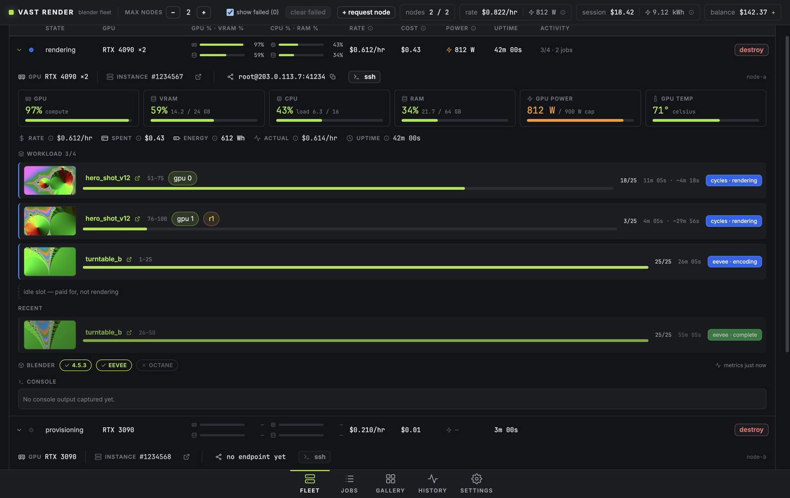
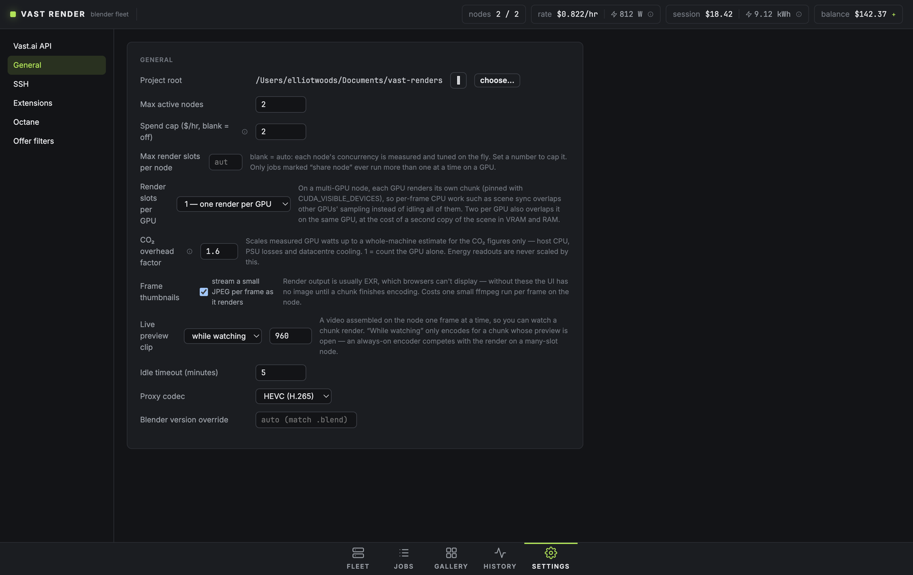
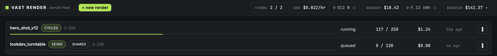

# Vast Render

A desktop app (Electron) that renders Blender projects on [Vast.ai](https://vast.ai)
GPU fleets. Point it at a `.blend`, and it rents the best-value machines,
provisions them (matching Blender version, ffmpeg, render agent), splits the
animation into frame chunks across the fleet, streams frames and HDR preview
clips back to your disk as they finish, and destroys the machines when done.

Vast.ai rents time on other people's GPU machines — typically far cheaper than
dedicated cloud render farms. This app automates the whole lifecycle from an
API key: no manual SSH, no third-party file sync.



*The fleet: one row per rented machine with live %GPU, %VRAM, %CPU, %RAM,
watts, $/hr and accumulated cost. Expanding a row shows the full node panel —
gauges, ssh access, what it's rendering, and its console.*

## Features

- **Fleet rendering** — set a max node count and a spend cap; jobs are split
  into frame chunks and distributed. Failed machines are replaced and only
  missing frames re-render.
- **Node sharing** — tick *Share node* on a job whose renders leave the
  machine under-used (a long CPU step before each frame, say) and its chunks
  run alongside other renders instead of taking a whole node each. The app
  measures throughput per node and tunes the number of concurrent renders on
  its own; *Max render slots per node* in Settings caps it if you want.
- **Engines** — Cycles (OptiX/CUDA, all GPUs), EEVEE (per-node capability
  probe), Octane (see `docs/OCTANE.md`).
- **Automatic Blender version matching** — the app reads each `.blend`'s
  header and installs the matching Blender release on the nodes
  (side-by-side per version; override in Settings).
- **Direct, verified transfers** — scenes go up and frames come down over the
  instance's own SSH (SFTP, SHA-256 verified, resumable). No Dropbox, no
  cloud bucket, no credentials on untrusted machines.
- **Remote preview encodes** — each chunk is encoded on the node to H.265:
  SDR, 10-bit HLG BT.2020 **HDR**, and a small proxy — all All-Intra for
  frame-exact scrubbing.
- **Gallery** — a video wall of preview clips with a frame-exact transport
  (timecode, frame stepping, draggable playhead), exposure/grade controls,
  HDR passthrough on HDR displays, and click-to-open into Explorer for every
  frame, clip and folder.
- **Extensions** — register Blender extension zips (Blender 4.2+ manifest
  format) in Settings; they're uploaded and enabled on nodes per job. Scenes
  can also carry `startup*` text blocks, executed before rendering.
- **Live telemetry** — %GPU, %VRAM, true %CPU (from `/proc/stat` deltas, not
  load average), %RAM, GPU watts, and Wh of energy per node.
- **Cost control** — live $/hr, per-node accumulated cost and realised $/hr,
  session spend and session energy, account balance, idle timeout
  auto-destroy, spend cap, and boot-time reconciliation that destroys any
  orphaned instances this app created.

## Install and run

Prebuilt Windows installer:
[latest release](https://github.com/elliotwoods/vastai-blender/releases/latest).
It is unsigned, so SmartScreen will ask for a confirmation on first run.

From source:

```bash
npm install
npm run dev          # development (Vite + Electron, hot reload)
npm run build:win    # packaged Windows build (electron-builder)
npm test             # unit tests
npm run typecheck    # main + renderer type checks
```

If `npm run dev` reports "Electron uninstall", the Electron binary download
was interrupted — see `docs/hdr-notes.md` for the manual fix.

## First run

1. **Settings → Vast.ai API** — paste your API key (from
   [cloud.vast.ai](https://cloud.vast.ai) → Account). It's stored encrypted
   with your OS user credentials (DPAPI on Windows). An SSH keypair is
   generated on first use and registered with your Vast.ai account.
2. **Settings → General** — set the project root (where renders land), max
   active nodes, spend cap ($/hr), idle timeout, and (optionally) a cap on
   render slots per node — leave it blank to let the app judge concurrency.
3. **Settings → Offer filters** — GPU allowlist, max $/hr, minimum
   VRAM/network/reliability. Turn on *CPU-bound* for scenes whose frame time
   is dominated by CPU work, so ranking stops favouring premium datacenter
   GPUs.
4. **Settings → Extensions** *(optional)* — register any Blender extension
   zips your scenes need.



## Rendering a job

Pack your textures into the `.blend` first (File → External Data →
Automatically Pack Resources) — only the `.blend` itself is uploaded.

**Jobs → new render**: pick `.blend` file(s), the engine, the frame range and
step, optionally the extensions to enable and a chunk size (blank = the
scheduler picks one so each node gets ~3 chunks). Submit.



From there it is automatic: nodes start while there's queued work, chunks are
dispatched, frames download as each chunk finishes, and nodes are destroyed
once they've been idle past the timeout. A job page shows per-chunk state and
the live console; the Gallery shows the preview clips as they arrive.

Useful controls while a job runs:

- **Fleet → max nodes** — raise or lower the fleet size live; the scheduler
  scales toward it as long as the spend cap allows.
- **Fleet → + request node** — add one machine immediately.
- **Fleet → row → ssh** — open a terminal on that machine using the app's own
  key (clicking the ssh endpoint copies the command instead).
- **Fleet → row → destroy** — kill a bad machine; its chunks are re-queued.
- **Jobs → cancel** — stop dispatching; finished frames are kept.

## Headless campaigns

For batches too big to click through, `VR_JOB_SPEC` submits a whole campaign
at boot:

```jsonc
{
  "blends": [
    "C:/scenes/shot_010.blend",
    { "path": "C:/scenes/shot_020.blend", "frameStart": 1, "frameEnd": 60 }
  ],
  // or "blendDir": "C:/scenes/campaign"
  "engine": "eevee",
  "frameStart": 1, "frameEnd": 200, "frameStep": 1,
  "addonZips": ["C:/addons/auroravision-0.2.0.zip"],
  "chunkSize": null,
  "maxActiveNodes": 4,
  "shareNode": true, // let these jobs co-run on a node (per-blend override too)
  "maxNodeSlots": 0, // 0/omitted = the app decides concurrency per node
  "spendCapPerHour": 2,
  "offerFilters": { "cpuBound": true }
}
```

```bash
VR_JOB_SPEC=C:/specs/campaign.json npm run dev
```

Re-running the same spec **heals** partially complete jobs (revives failed
chunks) rather than duplicating them. Events and node logs are mirrored to
stdout in this mode so a scripted run is diagnosable.

Other environment switches (development aids):

| Variable | Effect |
| --- | --- |
| `VR_MOCK=1` | Serve mock nodes/jobs to the UI — no Vast.ai calls |
| `VR_SCREEN=jobs` | Open on a given screen (`fleet`, `jobs`, `job`, `gallery`, `history`, `settings`, `gradelab`) |
| `VR_SHOT=out.png` | Capture the window after load (`VR_SHOT_DELAY` ms, default 6000) |
| `VR_USERDATA=dir` | Use a throwaway profile (own settings, own SQLite state) |
| `VR_E2E_BLEND=x.blend` | Single-blend end-to-end test run |

`VR_SCREEN` is appended to the dev-server URL verbatim, so it can carry the
screens' own parameters: `history&metric=power&range=7d`,
`settings&section=general`, `job&jobId=<id>`, `gallery&jobId=<id>&chunkId=<id>`,
`fleet&expand=1`, and `job&jobId=<id>&preview=<chunkId>&frame=<n>` to open the
preview overlay (otherwise only reachable by clicking, so uncapturable in a
scripted run). `gradelab&run=1` runs the grade-parity sweep and prints its result.

`VR_USERDATA` must be a **non-empty** path — an empty value falls back to the real
profile. On Windows, copy `Local State` from the real profile into a throwaway one
if you need the stored API key to decrypt there: Chromium keeps the `safeStorage`
key in that file, DPAPI-wrapped.

## How machines are chosen

Offers are ranked by `perf-per-dollar × reliability² × network`, where
perf-per-dollar prefers **your own measured render throughput** for a GPU
model (learned from completed chunks) over Vast's synthetic benchmark. In
CPU-bound mode, machines with no measured throughput are ranked by CPU clock
and effective cores per dollar instead, with the GPU benchmark capped so it
only tie-breaks. The strategy lives in `src/main/vast/offers.ts`; filters are
in Settings → Offer filters.

## Repository layout

- `src/main` — Electron main process: Vast.ai client, SSH/SFTP, node
  lifecycle, scheduler, settings, SQLite state.
- `src/renderer` — the UI (React + TypeScript).
- `src/shared` — the typed IPC contract shared by both.
- `remote/` — scripts that run **on the nodes** (provisioning, render agent,
  preview encoder). Uploaded verbatim over SFTP; stdlib Python + bash only.
  `npm test` cannot reach these, so `python3 remote/agent/selfcheck.py` covers the
  agent behaviour that is easiest to get wrong.
- `docs/` — setup notes, Octane specifics, HDR/codec findings, screenshots.

## Notes

- The render output contract for previews assumes linear Rec.709 EXR
  (Blender's `Standard` view transform); scenes rendering to PNG/JPG still
  work but get SDR previews only.
- Blender 5.x defaults to a Vulkan GPU backend; provisioning installs the
  Vulkan loader and the EEVEE probe falls back to OpenGL when Vulkan is
  unavailable on a node.
- Spend, energy (Wh), GPU draw and fleet size are metered once a minute and
  persisted in SQLite, so the History screen survives a restart. Everything there
  is what this app observed **while running** — it never reads back Vast.ai's
  billing, so totals read low for any period the app was closed.
- Versioning and release notes: see [CHANGELOG.md](CHANGELOG.md).
- License: this repo previously bundled a GPL-licensed Dropbox uploader,
  which set the repo license; that bundle is gone, so the license can now be
  revisited.
